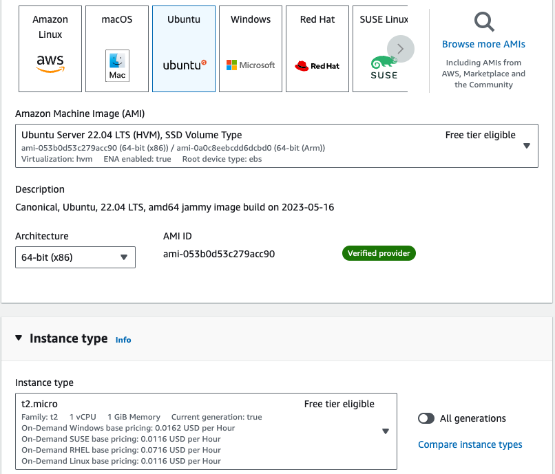

Tutorial: Managing containers with the LXD REST API

This tutorial is for people wanting to better understand how REST APIs work through HTTP commands.  We will be using simple HTTP requests to create and manage containers on an Ubuntu instance running in AWS on EC2. All of the actions and steps below can be performed within your web browser and without incurring any charges in your AWS account (the resources created are all free-tier eligible).  

You will need an AWS account (which is free to sign up for).  Additionally, the steps required for accessing an EC2 instance command line from within a browser window are not covered. See this link [to set up Session Manager](https://https://docs.aws.amazon.com/systems-manager/latest/userguide/session-manager-getting-started.html)

1. In the AWS console, type "EC2" into the search bar at the upper left.  When the EC2 service icon appears, select it.

2. From the EC2 Dashboard, select "Launch Instance".

3. Enter a name for your instance in the "Name and tags" card.

4. In the "Application and OS Images" card, select Ubuntu, then in the Amazon Machine Image (AMI) pull-down menu, you should see "Ubuntu Server 22.04 LTS (HVM), SSD Volume Type" along with "Free tier eligible".

5. If "t2.micro" is not already selected as the instance type, select if from the Instance type pulldown menu. 

You do not need to select a key pair if you have session manager enabled. 

6. Leave the remaining options at the default settings and select the "Launch Instance" button at the bottom.

7. If you are not automatically returned to the Instances page, select "Instances" from the left hand navigation menu. You should see you instance now displayed in the instances list. Select the check mark next to it, and then select the "Connect" button at the top console.

Images/image2.png

8. Select "connect" again, and you should have a new browser window open, displaying the command line of your new Ubuntu instance.

9. Elevate your user privileges by entering

sudo su

into the command line and selecting 'enter'.

10. Like most REST APIs, the LXD REST API responses to the http commands we will be using return data in JSON. To help understand these response elements install the jq JSON parser with following command:

snap install jq 

11. To start the lxd server enter the following command

lxd init

Use the default option set with the exception of LXD server network availability, to which you should respond "yes".  Use the default for the remainder of the options presented (you will also need to set a client password for server access).

12. Use the following command to confirm there are no containers currently running on your LXD server

lxc list 

13.  To create a container through the REST API, we are going to use curl and the POST command to create and send it to the local unix.socket. Enter the following at the command prompt

curl -s --unix-socket /var/snap/lxd/common/lxd/unix.socket -X POST -d '{"name": "myContainer", "source": {"type": "image", "protocol": "simplestreams", "server": "https://cloud-images.ubuntu.com/daily", "alias": "22.04"}}' a/1.0/instances | jq .

Images/image3.png

14. Enter the following into the command prompt to see if your container is now successfully running

lxc list

You should see something like the following returned within shell

Images/image4.png

As you can see, the container we just created is not running.  To start this container we simply have to use REST API to update the state property of the "myContainer" object.

15. Enter the following command to start your container

curl -s --unix-socket /var/snap/lxd/common/lxd/unix.socket -X PUT -d '{"action":"start"}' a/1.0/instances/myContainer/state | jq .

16. Use the list command to check the container's state again.

lxc list

You should see your container now displayed with a running status (and an IP address assignment).

Images/image5.png

You can check out the LXD REST API specification directly at [this link.](https://documentation.ubuntu.com/lxd/en/latest/api/). 

It is left to you to experiment with curl and further LXD REST API commands to manage you containers. 
